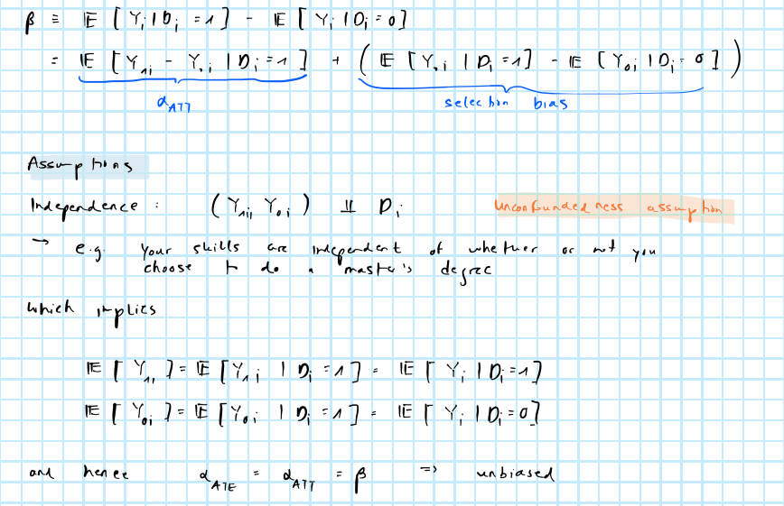
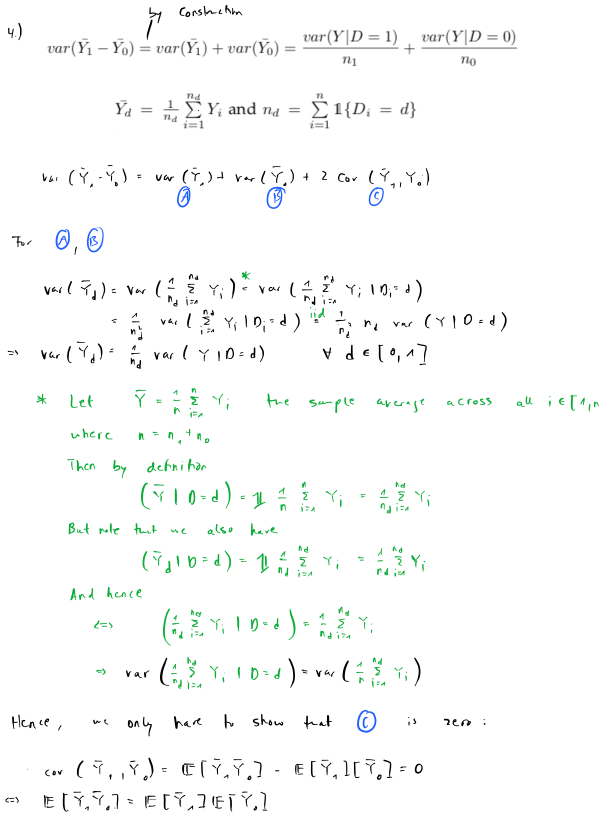
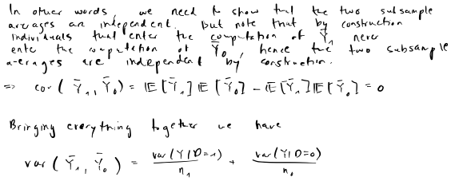

```{r setup, include=FALSE}
rm(list=ls())
knitr::opts_chunk$set(echo = TRUE)
library(reticulate)
```

# Part 1

```{r}
library(data.table)
dt <- data.table(foreign::read.dta("data_1.dta"))
```

The bottom line of @angelucci2009indirect is as follows: aid programs for the poor (eligible households) benefit the economy at large including the non-poor (ineligible households). I will use the notation from class which deviates slightly from that in the paper: $Y_{1i}$ shall denote the potential outcome for non-poor, ineligible households in treatment villages ($D_i=1$) in the *presence* of treatment. The potential outcome for the same individuals in the *absence* of treatment shall be denoted as $Y_{0i}$. Treatment here can be stood as an indirect treatment since it truly reflects treatment of poor, eligible households. More specifically, poor households in treatment villages are exposed to Progresa (the aid program) and the authors are primarily interested in the *indirect* treatment effect (ITE) of their richer neighbours that do not qualify for aid. The ITE shall be denoted as:

$$
\begin{aligned}
&& ITE&= \mathbb{E} \left( Y_i | D_i=1 \right) - \mathbb{E} \left( Y_i | D_i=0 \right) \\
\end{aligned}
$$

This notation is slightly simplified from the paper -- in particular, I omit $NP_i=1$ an indicator variable defining non-poor households. It is safe to omit that terms since we are only interested in the potential outcome of non-poor households anyway and this notation is both easier to follow and more in line with the notation from class.

The authors propose two hypotheses namely that 1) the consumption of non-poor households in treatment villages increases -- $ITE_C>0$ -- and that 2) they receive higher net transfers -- $ITE_L>0$.

## 1.)

First, I turn the data frame into tidy format and get rid of missing values of the treatment indicator $D_i$ (columns `treatp` and `treatnp`):

```{r}
dt <- melt(dt, measure.vars = c("treatp", "treatnp")) # tidy format
dt <- dt[!is.na(value)]
```

Then group averages of control and treatment groups can be computed easily as follows:

```{r table-1}
group_avg <- dt[,.(avg=mean(consump, na.rm=T), sd=sd(consump, na.rm = T)),by=.(variable, value, time)] # group averages
```

Now we shall turn to the ITE estimates.

**Differences in sample averages**

We can use the estimated group averages from above to produce estimates of the ITE as follows:

```{r}
ite_sample_avg <- dcast(group_avg, variable + time ~ value, value.var = "avg")[,ite:=`1`-`0`]
ite_sample_avg[,.(variable, time, ite)]
```

**Regression**

To instead reproduce the coefficient estimates from the paper we regress linearly according to the following model:

$$
\begin{aligned}
&& Y_i&= \mathbb{E} \left( Y_{0i} \right) + (Y_{1i}-Y_{0i} D_i + (Y_{0i}- \mathbb{E} \left( Y_{0i} \right)))\\
&& Y_i&= \beta_0 + \beta_1 D_i + u_i\\
\end{aligned}
$$

Denoting $\mathbf{x}_i=( 1, D_i)$ and $\mathbf{X}$ as the stacked matrix of regressors we can solve for the vector of coefficients through least-squares $\hat\beta={(\mathbf{X}^T \mathbf{X})}^{-1}\mathbf{X}^T \mathbf{Y}$. This can be computated efficently through QR-decomposition

```{r}
ite_regression <- dt[,.(ite=qr.solve(cbind(1,value), consump)[2]),by=.(variable, time)]
ite_regression[order(variable, time)]
```

where in column `ite` I store only the coefficient of interest on $D_i$.

Finally, let us turn to standard errors which are clustered at the village level. It is relatively straight-forward to compute clustered standard errors from scratch as follows (see [here](https://en.wikipedia.org/wiki/Clustered_standard_errors))

$$
\begin{aligned}
&& \text{var}(\hat\beta)&= \frac{K}{(K-1)} \frac{N}{(N-P)}
  {(\mathbf{X}^T \mathbf{X})}^{-1} \left( \sum_{k=1}^{K} \mathbf{x}_k^T \hat{\mathbf{u}}_k \hat{\mathbf{u}}_k^T \mathbf{x}_k \right) {(\mathbf{X}^T \mathbf{X})}^{-1} \\
\end{aligned}
$$

where $k \in [1,K]$ are group-level (village-level) indices, $N$ is the total number of observations and $P$ is the number of regressors. To compute this expression I have put together a small helper function, which takes as inputs the the matrix of regressors, the residuals and the cluster variable.

```{r}
cluster_se <- function(X,res,cluster) {
  M <- length(unique(cluster)) # number of groups (villages)
  X <- cbind(1,X)
  N <- nrow(X) # number of observations
  K <- ncol(X) # number of regressors including intercept
  dof <- (M/(M-1))*(N/(N-K)) # correction term for degrees of freedom
  inner_term <- Reduce(
    "+",
    lapply(
      unique(cluster),
      function(k) {
        row_idx <- which(cluster==k)
        if (length(row_idx)>1) {
          inner_term <- crossprod(t(crossprod(X[row_idx,], res[row_idx])))
        } else {
          inner_term <- crossprod(t(crossprod(t(matrix(X[row_idx,])), res[row_idx])))
        }
        return(inner_term)
      }
    )
  )
  vcov <- dof * qr.solve(crossprod(X)) %*% inner_term %*% qr.solve(crossprod(X))
  return(vcov)
}
```

Using this helper function clustered standard can be computed as follows:

```{r}
village_var <- "local" # variable indicating village
# Compute clustered SE:
source("R/utils.cluster_se.R") # helper function
ite_se <- dt[
  ,
  .(
    se=sqrt(
      cluster_se(
        X=value, 
        res=qr.resid(qr.default(cbind(1,value)), consump),
        cluster = get(village_var)
      )[2,2]
    )
  ),
  by=.(variable, time)
]
ite_se
```

These values do not perfectly match the values in the paper. But note that there is also a small technical [paper](http://www.ne.su.se/polopoly_fs/1.216115.1426234213!/menu/standard/file/clustering1.pdf) that demonstrates how to compute clustered standard errors in R. Using the function presented in the paper I get the same results up to small differences due to rounding. This reassures that my helper function is correct.

```{r}
clx <- function(fm, dfcw=1, cluster) {
  library(sandwich)
  library(lmtest)
  M <- length(unique(cluster))
  N <- length(cluster)
  dfc <- (M/(M-1))*((N-1)/(N-fm$rank))
  u <- apply(estfun(fm),2,function(x) tapply(x, cluster, sum))
  vcovCL <- dfc*sandwich(fm, meat=crossprod(u)/N)*dfcw
  coeftest(fm, vcovCL) 
}
dt[,.(se=clx(lm(consump ~ value), cluster = get(village_var))[2,2]),by=.(variable, time)]
```

Finally, let us bring it all together to produce a nice table. Here we will use the regression estimates for the ITE as in @angelucci2009indirect rather than the differences in sample averages. I also make the simplifying assumption that the estimated parameters come from a Gaussian distribution to compute p-values (a more conservative approach would use a t-distribution; more on this in 3.) below). R's `kable` function can in principle be used to create tables such as the one in the paper, but this is a bit tedious so I just present the table in tidy (long) format here:

```{r}
setnames(group_avg, c("variable", "avg", "sd"), c("household", "estimate", "noise"))
group_avg[,value:=ifelse(value==1,"Treatment","Control")]
setkey(ite_regression, variable, time)
setkey(ite_se, variable, time)
ite <- ite_se[ite_regression]
setnames(ite, c("variable", "ite", "se"), c("household", "estimate", "noise"))
ite[,value:="ITE"]
tab <- rbind(group_avg, ite)
tab[,household:=ifelse(household=="treatp", "Eligibles", "Ineligibles")]
tab[,household:=factor(household, level=c("Ineligibles", "Eligibles"))]
tab[,time:=ifelse(time==8,"Nov. 1998",ifelse(time==9, "May 1999", "Nov. 1999"))]
tab[,time:=factor(time, levels=c("Nov. 1998", "May 1999", "Nov. 1999"))]
tab[,value:=factor(value, level=c("Control", "Treatment", "ITE"))]
setorder(tab, household, value, time)
# Compute p-values
tab[,p_val:=2*(pnorm(-abs(estimate/noise)))]
tab[,signif:=ifelse(p_val<=0.01,"***",ifelse(p_val<=0.05, "**", ifelse(p_val<=0.1, "*", "")))]
knitr::kable(
  tab, 
  digits = 2,
  col.names = c(
    "Household",
    "Value",
    "Date",
    "Estimate",
    "Noise",
    "p-value",
    "Significance"
  )
)
```

## 2.)

Under the unconfoundedness assumption the estimated ITE is causal -- it provides an estimate of how Progresa, so financial aid provided to the poor, *indirectly* affects consumption levels of the non-poor. In particular, the authors find that following the introduction of the aid program, food consumption of the non-poor increased by 19.3 and 17.3 pesos per adult in May and November 1999, respectively. Assuming unconfoundedness is reasonable in this setting, since treatment is *randomly* assigned to villages, which by construction ensures independence $Y_{1i},Y_{0i} \perp \!\!\! \perp D_i$. In this case there is no selection bias and the measured effect is causal as we established analytically in class:



With all of that said, it is worth noting that the authors confess that despite the randomization, equation (1) in @angelucci2009indirect does not identify an average ITE if non-poor households in control villages are also affected by the program. But as they rightly point out, this would push down on the measured ITE, so if anything the estimated coefficients represent an underestimate of the true causal effect.

## 3.)

A straight-forward way to test for significance is to assume a Gaussian prior distribution for the parameters

$$
\begin{aligned}
&& \beta& \sim \mathcal{N}(\mathbf{0}, \Sigma_{\beta}^2) \\
\end{aligned}
$$

which implies that $\Sigma_{\beta}^{-1}\beta=\mathbf{z} \sim \mathcal{N}(\mathbf{0},\mathbb{I}_P)$. Now let $\hat{\mathbf{z}}=(\hat{\Sigma}_{\beta})^{-1/2}\hat\beta$ the vector of standardized point estimates where $\hat{\Sigma}_{\beta}=\frac{K}{(K-1)} \frac{N}{(N-P)}{(\mathbf{X}^T \mathbf{X})}^{-1} \left( \sum_{k=1}^{K} \mathbf{x}_k^T \hat{\mathbf{u}}_k \hat{\mathbf{u}}_k^T \mathbf{x}_k \right) {(\mathbf{X}^T \mathbf{X})}^{-1}$ is the "sandwich" estimator of the covariance matrix under the assumption of clustered standard errors (as discussed above). Then -- using a two-sided test -- we can compute a vector of p-values $\hat{\mathbf{p}}$ as follows

$$
\begin{aligned}
&& \hat{\mathbf{p}}&= \mathbb{P} \left( |\mathbf{z}| > \hat{\mathbf{z}} \right) = 2 \mathbb{P} \left( - |\mathbf{z}| < -|\hat{\mathbf{z}}| \right) = 2 \Phi(-|\hat{\mathbf{z}}|)\\
\end{aligned}
$$

where $\Phi(x)$ is the CDF of a standard Gaussian. The estimated p-values can then be compared to a significance level $\alpha$ of our choice. We say that the parameter estimates are statistically significantly different from zero (i.e. their expected value under the null) if $\hat{p}<\alpha$.

In this particular case we may instead want to opt for a one-sided test in order to have higher power to reject the null hypothesis $H_0$. That is, if we are willing to assume the causal effect from the aid program to consumption can never be negative, then we can test for significance only on the right tail. Specifically, given a significance level of $\alpha=0.05$ we would reject $H_0$ if $|\hat{\mathbf{z}}|>1.96$ using a two-sided test, compared to the weaker condition that $\hat{\mathbf{z}}>1.64$ using a one-sided test.

As flagged above, in cases where the sample size is small it is often more appropriate to assume that $\beta$ follows a student $t$-distribution, rather than a Gaussian distribution. The sample sizes here are large enough to safely assume that the parameter is Gaussian.

## 4.)

See the derivation below:

 

# Part 2

```{python}
import pandas as pd
import numpy as np
import statsmodels.api as sm
import matplotlib.pyplot as plt
from sklearn.linear_model import LogisticRegression
from sklearn.preprocessing import StandardScaler
from sklearn.neighbors import NearestNeighbors
```

```{python}
cps_controls = pd.read_stata('dw_data/cps_controls.dta')
cps_controls2 = pd.read_stata('dw_data/cps_controls2.dta')
cps_controls3 = pd.read_stata('dw_data/cps_controls3.dta')
psid_controls = pd.read_stata('dw_data/psid_controls.dta')
psid_controls2 = pd.read_stata('dw_data/psid_controls2.dta')
psid_controls3 = pd.read_stata('dw_data/psid_controls3.dta')
nsw_dw = pd.read_stata('dw_data/nsw_dw.dta')
```

## 1.)

$\newcommand\ci{\perp\mkern-10mu\perp}$

Results in Table 2 give an estimate of the average NSW treatment effect for different comparison groups/subsets, whereas:

Row 1 reflects the ATT under independence (We can assume independence $Y_{1i}$, $Y_{0i} \ci T_i$ because people have been randomly assigned to control & treatment, i.e, the comparison group here is the control group of the same experiment.

Row 2-7, are different subsets of non-experimental comparison groups. The fact that the treatment effect for the different non-experimental comparison groups is significantly different from the experimental one suggests that they are drawn from different populations, hence $Y_{1i}$, $Y_{0i} \ci T_i$ does not hold (for rows 2-7) According to the authors of the paper the comparison groups are drawn from a population that is more representative of the U.S general as a population than that of the NSW experiment (welfare recipients eligible for the program)

PSID-1 & CPS-1 differ from the experimental population in terms of age, marital status, ethnicity & pre-intervention earning, which is displayed in Table 1. Lalonde tried to control for these differences by subsetting the comparison groups into a sample that ought to represent the treatment population (CPS-2/3 PSID-2/3). But the differences remain significantly different from 0 at the 1% level.

## 2.)

If $X_i$ discrete and takes on $j$ possible values $\{X_j\}_{j=1}^{J}$

$$
\begin{equation} 
\begin{aligned}
&&\hat{\alpha_{TT}} &= \frac{1}{N_1} \sum_{i:D_i=1} (Y_i - \bar{Y}_0^{j(i)})\\
\end{aligned}
(\#eq:att)
\end{equation}
$$

-   $X_i$ = vector of covariates for $i$th individual.

-   $N$ Observations

-   $N_i$ number of treated individuals.

under conditional independence: $Y_{1i}, Y_{0i} \perp D_i | X_i$ and $Y_{1i}, Y_{0i} \perp D_i | \pi(X_i)$

we need to estimate $\hat{Y_0^{j(i)}}$ in \@ref(eq:att).

$\hat{Y_0^{j(i)}}$ can be expressed as a weighted average of the outcomes of controlled individuals:

$$
\begin{equation} 
\begin{aligned}
&&\hat{Y}_{0i} &= \sum_{k:D_k=0} w(i, k)Y_k\\
\end{aligned}
(\#eq:wi)
\end{equation}
$$ 

where we can define the $w(i,k)$ in several different ways, e.g. radius matching:

$$
\begin{equation} 
\begin{aligned}
&& w(i, k)&= \frac{\mathbb{1}\{\Vert X_k - X_i \Vert < \epsilon \}}
{\sum_{k:D_k=0}\mathbb{1}\{\Vert X_k - X_i \Vert < \epsilon \}} \\
\end{aligned}
(\#eq:wei)
\end{equation}
$$ 

we average over controlled individuals that are within a specified distance $\epsilon$ in terms of covariates $X_i$

Combining \@ref(eq:att), \@ref(eq:wi), \@ref(eq:wei) we get:

$$
\begin{equation} 
\begin{aligned}
&& \hat{\alpha_{TT}}&=\frac{1}{N_1} \sum_{i:D_i=1} (Y_i - \sum_{k:D_k=0} \frac{\mathbb{1}\{\Vert X_k - X_i \Vert < \epsilon \}}
{\sum_{l:D_l=0}\mathbb{1}\{\Vert X_l - X_i \Vert < \epsilon \}}Y_k) \\
\end{aligned}
(\#eq:comb)
\end{equation}
$$ 

**Note**: If covariates $X_i$ are continuous and/or high-dimensional one can do the matching on $\hat{\pi}(X_i)$ (propensity score) instead. In this case, on would have to estimate $\hat{\pi}(X_i)$ non-parametrically or parametrically with e.g. Logit or Probit model.

## 3.)

The conditional independence assumption is valid whenever one can observe and control for all covariates that are responsible for significant pre-treatment differences between the treatment and the comparison group. (That are relevant for the potential outcomes)

Dehejia & Wahba seem to be able to replicate the experimental benchmark by using propensity score matching and controlling for all the covariates by selecting only a subset of the comparison group that is compatible to the treatment group. Therefore, yes, the conditional independence assumption seems to hold, but one needs to be very careful when conditioning on the covariates. One caveat to D&W's reproduced results is that they end up with very large standard error due to a very small sample, which introduces some doubts into the conditional independence assumption.

## 4.)

This is a function that concatenates treatment and control data and adds all additional variables as indicated in the footnote of Table 3 [@dehejia1999causal] to a dataset. Those that are not needed are gonna be selected out later.

```{python}
def add_variables(df):
    # concatenating treatment and control:
    control_dataset = pd.concat([nsw_dw, df], axis=0)
    control_dataset = control_dataset.reset_index(drop=True)
    # unemployment rate dummies:
    control_dataset['u74'] = control_dataset.re74.apply(lambda x: 1 if x == 0 else 0)
    control_dataset['u75'] = control_dataset.re75.apply(lambda x: 1 if x == 0 else 0)
    # higher order terms:
    control_dataset['education_2'] = control_dataset.education**2
    control_dataset['age_2'] = control_dataset.age**2
    control_dataset['age_3'] = control_dataset.age**3
    control_dataset['re74_2'] = control_dataset.re74**2
    control_dataset['re75_2'] = control_dataset.re75**2
    # interactions:
    control_dataset['education_re74'] = control_dataset.education*control_dataset.re74
    control_dataset['u74_black'] = control_dataset.u74*control_dataset.black
    return control_dataset

# applying the function to each comparison group separately:
cps_controls = add_variables(cps_controls)
cps_controls2 = add_variables(cps_controls2)
cps_controls3 = add_variables(cps_controls3)
psid_controls = add_variables(psid_controls)
psid_controls2 = add_variables(psid_controls2)
psid_controls3 = add_variables(psid_controls3)

# giving names to the datasets that will later help us use different covariates for each dataset:
cps_controls.name = 'cps1'
cps_controls2.name = 'cps2'
cps_controls3.name = 'cps3'
psid_controls.name = 'psid1'
psid_controls2.name = 'psid2'
psid_controls3.name = 'psid3'
```

To compute propensity scores we define usage of covariates for different datasets:

```{python}
covariates_cps = [
  'age', 'age_2', 'education', 'education_2', 
  'nodegree', 'married', 'black', 'hispanic', 
  're74', 're75', 'u74', 'u75', 
  'education_re74', 'age_3'
]

covariates_psd1 = [
  'age', 'age_2', 'education', 'education_2', 
  'nodegree', 'married', 'black', 'hispanic', 
  're74', 're75', 're74_2', 're75_2',
  'u74_black'
]

covariates_psd23 = [
  'age', 'age_2', 'education', 'education_2', 
  'nodegree', 'married', 'black', 'hispanic', 
  're74', 're75', 're74_2', 're75_2',
  'u74', 'u75'
]
```

This function takes as an input a treated and a non-treated dataframe and creates the counterfactual outcome of the treated units $Y_{0i}$ by matching (Nearest Neighbor) on propensity scores:

```{python}
def get_matching_pairs(treated_df, non_treated_df):
    treated_x = treated_df.pscore.values
    non_treated_x = non_treated_df.pscore.values
    nbrs = NearestNeighbors(n_neighbors=1).fit(non_treated_x.reshape(-1, 1))
    distances, indices = nbrs.kneighbors(treated_x.reshape(-1, 1))
    indices = indices.reshape(indices.shape[0])
    matched = non_treated_df.loc[indices]
    return matched
```

```{python}
list_of_controls = [
  psid_controls, 
  psid_controls2, 
  psid_controls3, 
  cps_controls, 
  cps_controls2, 
  cps_controls3
]
list_of_controls_r = list_of_controls # save copy for R
```

Finally, we loop over the different data sets and compute the ATT based on differences in propensity matched sample means below. The results are broadly in line with the results in the paper with 1 or 2 exceptions.

```{python}
for control_dataset in list_of_controls: 
    # use different covariates for each control group:
    if control_dataset.name == psid_controls.name:
        covariates = covariates_psd1
    elif control_dataset.name in [psid_controls2.name, psid_controls3.name]:
        covariates = covariates_psd23
    elif control_dataset.name in [cps_controls.name, cps_controls2.name, cps_controls3.name]:
        covariates = covariates_cps
    # define dependent and independent variables:
    y = control_dataset['treat']
    X = control_dataset[covariates]
    # option to drop nodegree as indicated in the problem set:
    control_dataset.drop('nodegree', axis=1, inplace=True)
    # create propensity scores with a logit model:
    logit = LogisticRegression(random_state=5, max_iter=1000)
    model = logit.fit(X, y)
    propensity = [n[1] for n in model.predict_proba(X)]
    control_dataset['pscore'] = propensity
#### perform nearest neighbor matching based on propensity scores: ####
    # The experimental controls are assigned to treatment as they are from the same distribution as treated
    # (Deheija & Wahba p. 1057 bottom left)
    treated_df = control_dataset[control_dataset.data_id=='Dehejia-Wahba Sample'].reset_index(drop=True)
    non_treated_df = control_dataset[control_dataset.data_id!='Dehejia-Wahba Sample'].reset_index(drop=True)
    # apply nearest neighbor matching function defined above:
    matched_df = get_matching_pairs(treated_df, non_treated_df)
    # assign propensity scores to the dataframe of the treated:
    treated_df['re78_cf'] = matched_df.re78.values
    # option to test whether pscore computation makes sense:
    #print(matched_df.pscore.values - treated_df.pscore.values < 0.05)
    #### compute att: ####
    # we select only the target group of interest (treated individuals of the experimental group):
    att = treated_df[treated_df['treat']==1]['re78'].mean() - treated_df[treated_df['treat']==1]['re78_cf'].mean()
    print(f'ATT for {control_dataset.name}: {att}')

```


# References
