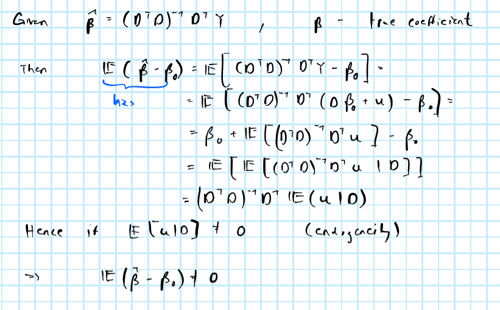
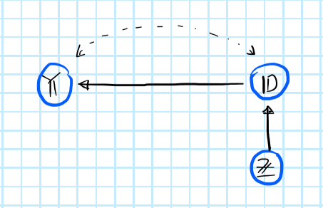
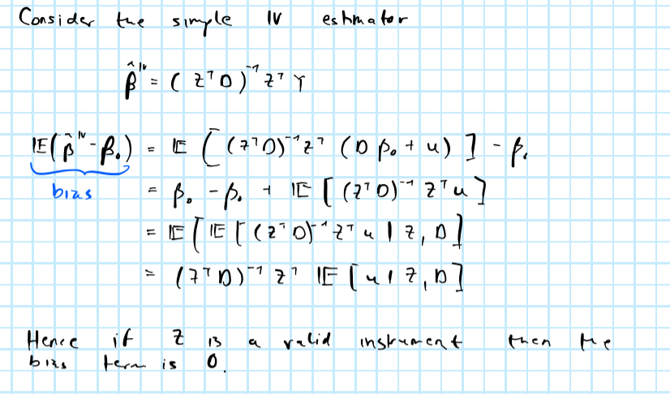
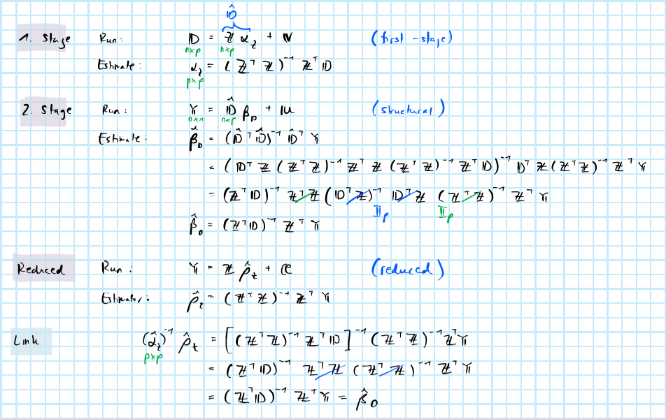
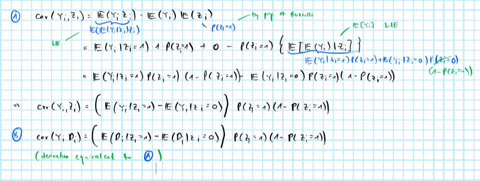
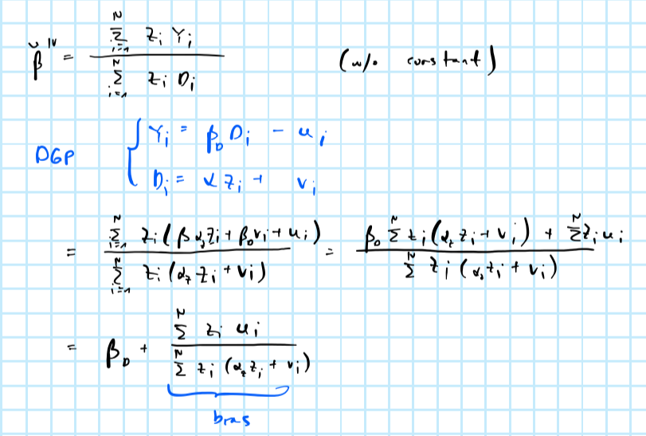
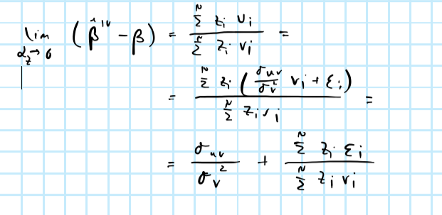

```{r setup, include=FALSE}
rm(list=ls())
knitr::opts_chunk$set(echo = TRUE)
library(reticulate)
library(data.table)
dt <- data.table(haven::read_dta("data/problemset2.dta"))
helper_functions <- list.files("R")
lapply(
  helper_functions,
  function(i) {
    source(file = file.path("R",i))
  }
)
```

@angrist1990lifetime *aim at studying the effects of military services during the Vietnam War on long-term earnings of the veterans. The author implements the Wald estimator by instrumenting military service with a draft-eligibility dummy that was determined by a lottery over birthdays. In particular, from 1970 to 1972, random sequence numbers were randomly assigned to each birth date in cohorts of 19 years old men. Men with lottery number below a given eligibility threshold number were eligible for the draft, while men above the threshold could not be drafted.*

# Simple vs. IV

```{r}
D <- dt$veteran
Z <- dt$eligible
y <- dt$earnings
```

I use the following to compute the OLS estimator $\hat\beta_{OLS}=(\mathbf{D}^T\mathbf{D})^{-1}\mathbf{D}^T\mathbf{Y}$

```{r, code=readLines("R/utils.ols.R")}
```

and the following function to compute the simple IV estimator $\hat\beta_{IV}=(\mathbf{Z}^T\mathbf{D})^{-1}\mathbf{Z}^T\mathbf{Y}$ (for general IV see a little further below).

```{r, code=readLines("R/utils.iv.R")}
```

For OLS I get the following point estimates

```{r}
ols(D,y)
```

where the first term reflects the constant (i.e. the average future earnings for individuals with veteran status equal to 0) and the second term indicates the measured effect of $\mathbf{D}$ on the outcome. It is straight-forward to see that this estimator is biased in case $\mathbf{D}$ is endogenous, that is $\mathbb{E} \left(\mathbf{D}^T\mathbf{u} \right)=\mathbb{E} \left(\mathbf{D}^T(\mathbf{Y}-\mathbf{D}\beta) \right)\ne0$:



For simple IV I get the following point estimates instead:

```{r}
iv(D,Z,y)
```

Equivalently, we could have used the general method of moments (GMM) IV estimator $\hat\beta_{OLS}=(\mathbf{D}^T\mathbf{P}_Z\mathbf{D})^{-1}\mathbf{D}^T\mathbf{P}_Z\mathbf{Y}$ to obtain the same result, where $\mathbf{P}_Z$ is the projection matrix onto the column space of $\mathbf{Z}$. The GMM IV estimator can also be used in cases where the model is over-identified.

```{r, code=readLines("R/utils.gmm.R")}
```

```{r}
gmm(D,Z,y)
```

Evidently, the point estimate of the effect of veteran status on earnings differs in sign and magnitude. When veteran status is not instrumented we saw above that the estimate was positive. Now using IV we find that the estimated effect of veteran status on earnings is highly negative, which given prior knowledge about this relationship seems more plausible: as @angrist1990lifetime put it "military experience is only a partial substitute for the civilian labor market experience lost while in the armed forces", hence intuitively one would expect a negative effect on lifetime earnings, which the IV estimator recovers, but OLS does not.

# Why does bias diappear?

The bias disappears under the assumption that the instrument is valid -- that is $(\mathbf{Y}_{1i},\mathbf{Y}_{0i})\perp \!\!\! \perp \mathbf{Z_i}|\mathbf{D_i}$ and relevant -- that is $\mathbf{Z_i} \not\!\perp\!\!\!\perp \mathbf{Y_i}|\mathbf{D_i}$. This implies a structural causal model which can be illustrated through a causal graph:



We can show that the bias disappears under these assumptions as follows:



# Structural, reduced and first-stage equations

## Univariate

To work out the given formula where $\hat\beta_D= \frac{\hat\rho_Z}{\hat\alpha_Z}$ is a scalar, we need to work in the univariate setting. The first stage equation is the regression of treatment $D_i$ on the instrument $Z_i$: 

$$D_i = \alpha_0 + \alpha_ZZ_i + \epsilon_i^{ZD}$$

with the first stage estimator: $\hat{α}_Z=(Z^{T}Z)^{-1} Z^{T}D$

The structural equation is the regression of outcome $Y_i$ on the treatment $D_i$ (The naive regression we would run if we did not know we need an instrument due to endogeneity):

$$Y_i = \beta_0 + \beta_D D_i + \epsilon_i^D$$

with the structural estimator: 

$$\hat{\beta}_D = (D^{T}D)^{-1} D^{T}Y$$

The reduced form equation is the regression of outcome $Y_i$ on the instrument $Z_i$: 

$$Y_i = \rho_0 + \rho_Z Z_i + \epsilon_i^{ZY}$$
with the structural estimator: 

$$\hat{\rho}_D = (Z^{T}Z)^{-1} Z^{T}Y$$

$$
\begin{align}
Y_i & = \beta_0 + \beta_DD_i + \epsilon_i^D \\
    & = \beta_0 + \beta_D(\alpha_0 + \alpha_ZZ_i + \epsilon_i^{ZD}) + \epsilon_i^D \\
    & = (\beta_0 + \beta_D\alpha_0) + \beta_D\alpha_ZZ_i + (\beta_D\epsilon_i^{ZD} + \epsilon_i^D) \\
    & = \rho_0 + \rho_ZZ_i + \epsilon_i^{ZY}
\end{align}
$$

By equating coefficients we get

$$
\rho_0 = \beta_0 + \beta_D\alpha_0, \\
\rho_Z = \beta_D\alpha_Z, \\
\epsilon_i^{ZY} =  \beta_D\alpha_ZZ_i + (\beta_D\epsilon_i^{ZD} + \epsilon_i^D) 
$$

Therefore, 

$$ \beta_D = \frac{\rho_Z}{\alpha_Z} $$

Running the first-stage and reduced form equations and plugging the obtained parameter estimates into the equations above we can solve for $\hat\beta$

```{r}
alpha <- ols(Z,D) # first-stage
rho <- ols(Z,y) # reduced
beta_D <- rho[2]/alpha[2]
beta_0 <- rho[1] - beta_D * alpha[1]
matrix(c(beta_0,beta_D))
```

## More generally

We can link this to 2SLS and show more generally that 

$$
\begin{equation} 
\begin{aligned}
&& \hat\beta_D&= (\hat\alpha_Z)^{-1}\hat\rho \\
\end{aligned}
(\#eq:general)
\end{equation}
$$

where $\hat\beta_D$ is a $(p \times 1)$ vector of parameters from the structural (second stage) regression, $\hat\alpha_Z$ is $(p \times p)$ matrix of parameters from the first stage regression and $\hat\rho$ is a $(p \times 1)$ vector of parameters from the reduced form regression.

The link can be established as follows:



We can make the simplification of the inverse in the second stage, instead of working with the projection matrix $\mathbf{P}_Z$ because the model is exactly identified, that is $\mathbf{D}, \mathbf{Z} \in \mathbb{R}^p$ are both of the same dimension. Consequently the term $(\hat{\mathbf{D}}^T\hat{\mathbf{D}})^{-1}$ is the inverse of a product of invertible square matrices and can be simplified according to the following property $(\mathbf{A}\mathbf{B})^{-1}=\mathbf{B}^{-1}\mathbf{A}^{-1}$.

We can explicitly implement these formulas as follows. First, regress all $p$ columns of $\mathbf{D}$ on all $p$ columns of $\mathbf{Z}$ including a constant (*first-stage*):

```{r}
alpha <- qr.solve(cbind(1,Z),cbind(1,D))
alpha
```

Run the *reduced form* regression:

```{r}
rho <- matrix(qr.solve(cbind(1,Z),y))
rho
```

Finally, implement equation \@ref(eq:general) from above:

```{r}
qr.solve(alpha) %*% rho
```

You can verify that this more general implementation holds for any $p$ as long as the system is exactly identified. Below I show a toy example with $p=5$. 

```{r}
Z_rand <- matrix(rnorm(500),100)
D_rand <- matrix(rnorm(500),100)
y_rand <- rnorm(100)
```

Implementing simple IV we obtain:

```{r}
iv(D_rand,Z_rand,y_rand)
```

Instead implementing the formula step by step:

```{r}
alpha <- qr.solve(cbind(1,Z_rand),cbind(1,D_rand))
rho <- matrix(qr.solve(cbind(1,Z_rand),y_rand))
qr.solve(alpha) %*% rho
```


Finally, going back to the context of the paper, we can just run 2SLS and once again obtain the same results as before using either the simple IV or GMM IV:

```{r}
# 1. Stage:
alpha <- ols(Z,D) # fit
D_hat <- cbind(1,Z) %*% alpha # predict
# 2. Stage:
beta_d <- ols(D_hat, y)
beta_d
```

# Wald estimand

The first-stage and reduced-form coefficients shown in the previous exercise can alternatively be expressed in terms of covariances:

$$
\begin{aligned}
&& \hat\alpha_Z&= \frac{\text{cov}(Z_i,D_i)}{ \text{var}(Z_i)}, && \hat\rho_Z= \frac{\text{cov}(Z_i,D_i)}{ \text{var}(Z_i)}\\
\end{aligned}
$$

Then we have for the structural coefficient:

$$
\begin{aligned}
&& \hat\beta_D&= \frac{\hat\rho_Z}{\hat\alpha_Z} =  \frac{\text{cov}(Z_i,Y_i)}{ \text{cov}(Z_i,D_i)} \\
\end{aligned}
$$

Then the Wald estimand can be derived as follows



where in green highlight the assumptions/properties I use. We can implement the Wald estimand in R as follows and indeed retrieve the same estimates.

```{r}
rbind(
  dt[,.(avg=mean(earnings),var="Y"),by=.(Z=eligible)], # average Y by Z
  dt[,.(avg=mean(veteran),var="D"),by=.(Z=eligible)] # average D by Z
)[
  ,
  .(value=avg[Z==1]-avg[Z==0]), # compute differences in averages
  by=.(var) # by variable (Y and D)
][
  ,
  value[var=="Y"]/value[var=="D"] # compute ratio of differences
]
```

# Exclusion restriction violated I

## What assumption is violated?

The exclusion restriction, namely that $\mathbf{Z}$ affects the outcome variable $\mathbf{Y}$ only through $\mathbf{D}$, is violated. With respect to the example at hand, the new setup suggests that the eligibility dummy has an effect on future earnings even in the absence of veteran status. In other words, future earnings are expected to depend on the outcome of the Draft Lottery independent of whether or not men actually ended up going to war. This is not entirely implausible. Consider for example the effect of the lottery outcome on never-taker. Suppose an never-taker is draft-eligible, but in order to avoid being drafted they choose to enrol in college, which they had not done if it were not for the lottery outcome. Then under the assumption that college education increase lifetime earnings, the lottery outcome has a positive effect on lifetime earnings, independent of veteran status. 

## Bias

An expression for the bias can be derived as follows:

$$
\begin{align}
𝔼[\hat{\beta} - \beta_D] & = 𝔼[(Z^{T}D)^{-1}Z^{T}Y - \beta_D] \\
                         & = 𝔼[(Z^{T}D)^{-1}Z^{T}(\beta_0 + D \beta_D + Z\beta_Z + u) - \beta_D] \\
                         & = \beta_D + 𝔼[(Z^{T}D)^{-1}Z^{T}(\beta_0 + Z\beta_Z + u)] - \beta_D \\ 
                         & = 𝔼[(Z^{T}D)^{-1}Z^{T}𝔼[u|Z,D] + 𝔼[(Z^{T}D)^{-1}Z^{T}(\beta_0 + Z\beta_Z)]) \\
\end{align}
$$

where the first term is zero since $𝔼[u|Z,D] = 0$ 
                         
$$
\begin{align}
\Leftrightarrow && 𝔼[\hat{\beta} - \beta_D]& = 𝔼[(Z^{T}D)^{-1}Z^{T}(\beta_0 + Z\beta_Z)]) \\ 
          &&               & = 𝔼[(Z^{T}(\alpha_0 + \alpha_Z Z + v))^{-1}Z^{T}(\beta_0 + Z\beta_Z)]) \\ 
                      &&   & = 𝔼[(Z^{T}(\alpha_0 + \alpha_Z Z) + Z^{T}v)^{-1}Z^{T}(\beta_0 + Z\beta_Z)]) \\ 
                      &&   & = 𝔼[(Z^{T}(\alpha_0 + \alpha_Z Z) + Z^{T}𝔼[v|Z])^{-1}Z^{T}(\beta_0 + Z\beta_Z)]) \\
\end{align}                      
$$
 
and because $𝔼[v|Z] = 0$ we finally have:

$$
\begin{align}
  \Leftrightarrow && 𝔼[\hat{\beta} - \beta_D]                       & = 𝔼[(Z^{T}(\alpha_0 + \alpha_Z Z))^{-1}Z^{T}(\beta_0 + Z\beta_Z)]) \\ 
                   &&      & = 𝔼[(\alpha_0 + \alpha_Z Z)^{-1}(Z^{T})^{-1}Z^{T}(\beta_0 + Z\beta_Z)]) \\ 
                    &&     & = 𝔼[(\alpha_0 + \alpha_Z Z)^{-1}(\beta_0 + Z\beta_Z)]) \\ 
\end{align}
$$

The final terms is clearly different from zero since $\beta_Z\ne0$. More specifically we can see that the magnitude of the bias increases in $\beta_Z$ -- the true direct effect from the instrument to the outcome -- and decreases in $\alpha_Z$ -- the effect from the instrument on the instrumented treatment dummy. 

# Local Average Treatment Effect (LATE)

The additional assumption needed in order to interpret the Wald estimator as the effect of veteran status on those whose treatment status can be changed by the instrument is *monotonicity*. Monotonicity means that there are *no defiers*, i.e.:

-   Men who would have ended up serving in the military without being drafted would also have served, had they been drafted.
-   Men who did not serve in the military despite having been drafted would not have served either, had they not been drafted.

Under these assumptions our IV estimator can be called the local average treatment effect for compliers, i.e.:

-   those that served in the military only because they have been drafted (they would not have served, had they not been drafted)
-   those that did not serve in the military only because they have not been drafted (they would have served if they had been drafted)

In other words, the estimated causal impact is that of the compliers, not of always- nor never-takers.

# Exclusion restriction violated II

## Do assumptions hold?

Since $α_Z$ measures the effect of the instrument $Z$ on $D$, $α_Z→0$ implies that the instrument is weak and hence the IV estimator is subject to weak instrument bias. The exclusion restriction is not satisfied as it requires relevance of the instrument. In other words, for there to be an exclusively through $D$ running effect, there must be an effect in the first place and with $α_Z→0$ there is none.

## Weak instrument

Since $\alpha_Z$ measures the effect of the instrument $\mathbf{Z}$ on $\mathbf{D}$, $\alpha_Z \rightarrow0$ implies that the instrument is weak and hence the IV estimator $\hat\beta_D$ is subject to weak instrument bias. 

The bias can be derived as follows. We have for the IV estimator



where the data generating process (DGP) is restated with constants equal to zero for simplification.

Then if $\sigma_vu \ne 0$ we can decompose it into its predictable component and noise

$$
\begin{aligned}
&& U_i&= \mathbb{E} \left( U_i|Vi \right) + \varepsilon_i= \frac{\sigma_{UV}}{\sigma_V^2}V_i +\varepsilon_i
\\
\end{aligned}
$$

And hence



Given $\mathbb{E}\left(\varepsilon_i|Z_i,V_i\right)=0$ the IV estimator suffers from the same bias as the OLS estimator. 

# References
