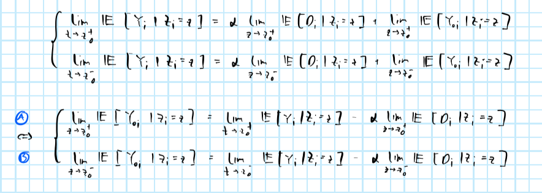
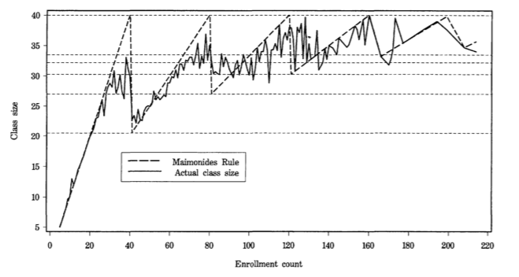

```{r setup, include=FALSE}
rm(list=ls())
knitr::opts_chunk$set(echo = TRUE)
library(data.table)
dt_angrist <- data.table(haven::read_dta("data/angrist1999.dta"))
dt_dell <- data.table(haven::read_dta("data/delldata_childstunt.dta"))
dt_dell_cons <- data.table(haven::read_dta("data/delldata_consumption.dta"))
helper_functions <- list.files("R")
lapply(
  helper_functions,
  function(i) {
    source(file = file.path("R",i))
  }
)
```

# Part 1: Dell, M., 2010. The persistent effects of Peru's mining mita. *Econometrica*.

## 1.

Explain what the "mita" system was and how it creates a discontinuity in the paper's context.Is that a sharp or fuzzy RD design, and why? Explain what "sharpness" and "fuzziness" mean in this context.

<hr>

From 1573 to 1812, the Spanish government in Peru and the Bolivia republic created a forced labor system forcing over 200 indigenous communities to send one-seventh of their adult male population to work in the Potosí Silver and Huancavelica mercury mines. This contribution scheme had a border discontinuity. On one side, all communities sent the same percentage of their population, while on the other side, all communities were exempt. Clearly, this is a 'sharp' discontinuity design since $D_i$ is a deterministic function of $Z_i$:

$$
\begin{equation} 
\begin{aligned}
&& D_i&=\mathbb{1}_{Z_i \ge z_0} \\
\end{aligned}
(\#eq:sharp)
\end{equation}
$$
For a 'fuzzy' discontinuity design, we would, for example, have some people on the control side of the border being sent to work in the mines (the closer to the border the more likely to be sent to work in the mines).

## 2.

Recall the two conditions that characterise an RD setup, discontinuity of treatment on $Z_i$ but continuity of potential outcomes on $Z_i$ in a neighbourhood of $z_0$, respectively formalised as

$$
\begin{equation} 
\begin{aligned}
&& \lim_{z \rightarrow z_0^+} P(D_{i} = 1 | Z_i = z)  &\ne  \lim_{z\rightarrow z_0^-} P(D_{i} = 0 | Z_i = z) \\
\end{aligned}
(\#eq:discontinuity)
\end{equation}
$$


$$
\begin{equation} 
\begin{aligned}
&& \lim_{z \rightarrow z_0^+} P(Y_{ij} \leq r | Z_i = z)  & =  \lim_{z\rightarrow z_0^-} P(Y_{ij} \leq r | Z_i = z) \\
\end{aligned}
(\#eq:continuity)
\end{equation}
$$


<hr>

### (a)

Show analytically how condition (2) above allows you to get

$$
\begin{equation} 
\begin{aligned}
\lim_{z\rightarrow z_0^+} \mathbb{E}[Y_{ij}| Z_i = z]    & =  \lim_{z\rightarrow z_0^-} \mathbb{E}[Y_{ij}| Z_i = z]
\end{aligned}
(\#eq:limits-eq)
\end{equation}
$$

<hr>

We can rewrite as follows

$$
\begin{align}
\lim_{z \rightarrow z_0^+} P(Y_{ij} \leq r | Z_i = z)  & =  \lim_{z\rightarrow z_0^-} P(Y_{ij} \leq r | Z_i = z) \\
\lim_{z\rightarrow z_0^+} F_{Y_{ij}}(r| Z_i = z)   & =  \lim_{z\rightarrow z_0^-} F_{Y_{ij}}(r| Z_i = z) \\
\lim_{z\rightarrow z_0^+} dF_{Y_{ij}}(r| Z_i = z)   & =  \lim_{z\rightarrow z_0^-} dF_{Y_{ij}}(r| Z_i = z) \\
\lim_{z\rightarrow z_0^+} \int_Y Y_{ij} dF_{Y_{ij}}(r| Z_i = z)   & =  \lim_{z\rightarrow z_0^-} \int_Y Y_{ij} dF_{Y_{ij}}(r| Z_i = z) \\
\end{align}
$$

and hence finally

$$
\begin{aligned}
\lim_{z\rightarrow z_0^+} \mathbb{E}[Y_{ij}| Z_i = z]    & =  \lim_{z\rightarrow z_0^-} \mathbb{E}[Y_{ij}| Z_i = z]
\end{aligned}
$$

### (b)

Suppose we are working on a homogeneous effects, sharp RD framework, so that $Y_i = \alpha D_i + Y_{0i}$. Use your previous findings to demonstrate formally that $\alpha$ can be identified as

$$
\begin{equation} 
\begin{aligned}
&& \alpha&= \lim_{z\rightarrow z_0^+} \mathbb{E} \left( Y_i|Z_i=z \right) - \lim_{z\rightarrow z_0^-} \mathbb{E} \left( Y_i|Z_i=z \right)\\
\end{aligned}
(\#eq:homo)
\end{equation}
$$

<hr>

Taking expectations with respect to $Z_i$ and limits from both sides we can rewrite:



By Equation \@ref(eq:limits-eq) we have that A and B are equal and hence:

$$
\begin{equation} 
\begin{aligned}
\alpha = \frac{\lim_{z \rightarrow z_0^+} \mathbb{E} \left[ Y_i | Z_i = z  \right]
  -\lim_{z \rightarrow z_0^-} \mathbb{E} \left[ Y_i | Z_i = z  \right]}{\lim_{z \rightarrow z_0^+} \mathbb{E} \left[ D_i | Z_i = z  \right] - \lim_{z \rightarrow z_0^-} \mathbb{E} \left[ D_i | Z_i = z  \right]}
\end{aligned}
(\#eq:alpha)
\end{equation}
$$

Since we have a sharp RD design the denominator is equal to 1 which yields the result in \@ref(eq:homo).

## 3.

Explain why Table 1 provides empirical evidence for the condition (3) to hold in the context of the paper. Why is that condition crutial for interpreting RD estimates as causal?

<hr>

The author claims that households' potential consumption outcome is a function of agricultural and social factors. The former is measured in terms of elevation and slope. The latter is measured in terms of the proportion of indigenous people log 1572 tribute rates et al. Table 1 shows that for these variables it is not possible to reject the null hypothesis of equality for overwhelming majority of cases. Especially near the border (i.e. at the limit) there are no significant differences. Therefore, we cannot reject that

$$\lim_{z\rightarrow z_0^+} \mathbb{E}[Y_{ij}| Z_i = z] =  \lim_{z\rightarrow z_0^-} \mathbb{E}[Y_{ij}| Z_i = z]$$

As we saw above this condition is crucial to arrive at \@ref(eq:alpha). Intuitively, this condition states that all relevant factors besides treatment must vary smoothly at the *mita* boundary. In other words, relevant factors other the the RD variable $Z_i$ must not affect the conditional distribution of the outcome variable near the cut-off $z_0$. This is intuitive, because only under this assumption do individuals just outside the *mita* represent a valid counterfactual for those just inside the *mita*.

## 4.

### (a)

What does $f(\text{geographic location}_d)$ stand for, and why is it so important for the estimation of $\alpha_{RD}$?

<hr>

The coefficient of interest $\alpha_{RD}$ represents the *average treatment effect* for individuals at the threshold. In @dell2010persistent $f(\text{geographic location}_d)$ is referred to as the regression discontinuity (RD) polynomial. For Panel C of Table 2, for example, it corresponds to the cubic polynomial of $Z_d$

$$
\begin{aligned}
&& f_{z_0}(Z_d)&=|Z_d|+|Z_d|^2+|Z_d|^3 \\
\end{aligned}
$$

where $Z_d$ in this case measures district $d$'s distance to the *mita* border.^[Worth noting here that individual $Z_i$ are a deterministic function of the district $d$ that the individual household inhabits.] In the context of RD, this corresponds to what we refer to as control function. It owes its name to the idea that it "controls" for selection bias in the case of heterogenous treatment effects. As this last point suggests, including $f(\text{geographic location}_d)$ is therefore important for an unbiased estimation of $\alpha_{RD}$.

### (b)

Table 2 describes the estimations results of that equation. What is the cutoff $z_0$ in the specification of Panel C? That is, what is $z$? How would you define $D_i$ as a function of it?

<hr>

For Panel C the cutoff $z_0$ is defined as the *mita* border itself. More specifically, $Z_d=z_0=0$ indicates that the district is right on the *mita* border. Furthermore, upon inspection of the data sets (`delldata_consumption.dta` and `delldata_childstunt.dta`) it becomes evident that negative values of $Z_d$ imply that district $d$ is within the *mita* zone. With respect to the data sets, $Z_d$ corresponds to column `dist_mita_brdr`. Hence we can let $Z_d \le z_0$ denote that individual $i$ is inside the *mita* region. Then we can define $D_i$ as $D_i=\mathbb{1}_{Z_i \le z_0}$. (Alternatively we can just multiply $Z_d$ by $-1$ and adopt the same notation as in class, namely: $D_i=\mathbb{1}_{Z_i \ge z_0}$).

### (c)

Use `delldata_consumption.dta` and `delldata_childstunt.dta` to replicate the results of Panel C. Make sure you specify $f(\text{geographic location}_d)$ and $D_i$ as discussed in (4a) and (4b), and that you check the table's notes to understand which is the specification used.

<hr>

Below I run the regressions separately first with log consumption as the dependent variable, then with the child stunt dummy. Since the data already comes with fixed effects dummies, I just fit a linear model with those fixed effect dummies included. Clustered standard errors are computed manually at the district level using the custom function `cluster_se` I put together for our first problem set. As in @dell2010persistent I exclude Cusco.

```{r code=readLines("R/utils.cluster_se.R"), eval=F}
```


```{r}
dt_dell_cons[,mita:=ifelse(dist_mita_brdr<=0,1,0)]
dt_dell_cons[,dist:=abs(dist_mita_brdr)]
dt_dell_cons[,dist2:=dist^2]
dt_dell_cons[,dist3:=dist^3]
sub_sample <- c(100, 75, 50)
reg_covariates <- c(
  "lhhequiv",
  "mita",
  "dist",
  "dist2",
  "dist3",
  "elv_sh",
  "slope",
  "bfe4_1",
  "bfe4_2",
  "bfe4_3",
  "hh_numb_infs",
  "hh_numb_chd",
  "hh_numb_adts"
)
dep_var <- "lhhequiv"
mods_cons <- lapply(
  1:length(sub_sample),
  function(i) {
    dist_temp <- sub_sample[i]
    Z <- dt_dell_cons[cusco!=1 & abs(dist_mita_brdr)<=dist_temp,.SD,.SDcols=reg_covariates]
    setnames(Z, dep_var, "y")
    mod <- lm(y ~ ., data=Z)
    # Clustered standard errors:
    X <- mod$model[,-1]
    res <- mod$residuals
    cluster <- dt_dell_cons[cusco!=1 & abs(dist_mita_brdr)<=dist_temp,distr]
    vcov <- cluster_se(X,res,cluster)
    se <- sqrt(diag(vcov))
    return(
      list(
        mod = mod,
        se = se
      )
    )
  }
)
```

```{r}
dt_dell[,mita:=ifelse(dist_mita_brdr<=0,1,0)]
dt_dell[,dist:=abs(dist_mita_brdr)]
dt_dell[,dist2:=dist^2]
dt_dell[,dist3:=dist^3]
sub_sample <- c(100, 75, 50)
reg_covariates <- c(
  "stunt",
  "mita",
  "dist",
  "dist2",
  "dist3",
  "elv_sh",
  "slope",
  "bfe4_1",
  "bfe4_2",
  "bfe4_3"
)
dep_var <- "stunt"
mods_stunt <- lapply(
  1:length(sub_sample),
  function(i) {
    dist_temp <- sub_sample[i]
    Z <- dt_dell[cusco!=1 & abs(dist_mita_brdr)<=dist_temp,.SD,.SDcols=reg_covariates]
    setnames(Z, dep_var, "y")
    mod <- lm(y ~ ., data=Z)
    # Clustered standard errors:
    X <- mod$model[,-1]
    res <- mod$residuals
    cluster <- dt_dell[cusco!=1 & abs(dist_mita_brdr)<=dist_temp,distr]
    vcov <- cluster_se(X,res,cluster)
    se <- sqrt(diag(vcov))
    return(
      list(
        mod = mod,
        se = se
      )
    )
  }
)
```

As evident from the table below, the coefficient estimates for *mita* are exactly the same as in the paper. Columns (1) to (3) correspond to the regression with consumption as the dependent variable. Columns (4) to (5) correspond to the model with stunted growth as the dependent variable. The clustered standard errors also match the ones estimated in the paper.

```{r, results='asis'}
mods <- c(mods_cons, mods_stunt)
se <- lapply(mods, function(i) i[['se']])
mods <- lapply(mods, function(i) i[['mod']])
suppressMessages(library(stargazer))
stargazer(
  mods, se=se, header=FALSE, 
  column.labels = c(
    "<100km",
    "<75km",
    "<50km",
    "<100km",
    "<75km",
    "<50km"
  ),
  type="html"
)
```

## 5.

Suppose we are interested in learning more about fuzzy RD frameworks with heterogeneous effects. Which is the difference with respect to the relation between $D_i$ and $Z_i$ that makes $\alpha_{RD}$ different from what you obtained in point (2b)

<hr>

The first main difference with respect 2b is that since we are dealing with heterogeneous treatment effects, our equation looks like: 

$$
Y_i = \alpha_i D_i + Y_{0i}
$$

Thus we can only hope to estimate an average treatment effect $𝔼[\alpha_i|Z_i = z_0]$.

In the case of sharp discontinuities the estimation of the parameter is still fairly simple:

$$
D_i = \mathbb{1}{z \geq z_0} \\
\begin{align}
𝔼[Y_i|Z_i = z] & = 𝔼[\alpha_i| Z_i = z]D_i + 𝔼[Y_{0i}| Z_i = z] 
\end{align}
$$

If we add and subtract $\pm𝔼[\alpha_i | Z_i = z_0]D_i$ we get:

$$
\begin{align}
𝔼[Y_i|Z_i = z] & = 𝔼[\alpha_i| Z_i = z]D_i + 𝔼[Y_{0i}| Z_i = z] \pm𝔼[\alpha_i | Z_i = z_0]D_i \\
& = \alpha_{RD}D_i + 𝔼[Y_{0i}|Z_i=z] + (𝔼[\alpha_i|Z_i = z] - 𝔼[\alpha_i | Z_i = z_0])D_i
\end{align}
$$

Let $k_{z0}(z) \equiv 𝔼[Y_{0i}|Z_i=z] + (𝔼[\alpha_i|Z_i = z] - 𝔼[\alpha_i | Z_i = z_0])D_i$ and we get:

$$
𝔼[Y_i|Z_i = z] = \alpha_{RD}D_i + k_{z_0}(z)\\
$$ 

Estimating this $\alpha_{RD}$ with OLS (Control function approach) we get $𝔼[\alpha_i|Z_i = z_0]$. Now, in the case of fuzzy RD design one can, as Dell did, assume conditional independence around $z_0$:

$$
(Y_{1i}, Y_{0i}) ⫫ D_i | Z_i = z
$$

Now we derive $\alpha$ in the same way we did in 2 (b):

$$
Y_i = \alpha D_i + Y_{0i}
$$

Taking limits and conditional expectations on $Z_i$:

$$ 
\begin{align}
\lim_{z \rightarrow z_0^+} \mathbb{E}[Y_i | Z_i = z] & = \alpha \lim_{z \rightarrow z_0^+} \mathbb{E}[D_i|Z_i = z] + \lim_{z \rightarrow z_0^+} \mathbb{E} [Y_{0i} | Z_i =z] \\
\lim_{z \rightarrow z_0^-} \mathbb{E}[Y_i | Z_i = z] & = \alpha \lim_{z \rightarrow z_0^-} \mathbb{E}[D_i|Z_i = z] + \lim_{z \rightarrow z_0^-} \mathbb{E} [Y_{0i} | Z_i =z]
\end{align}
$$

I then subtract the two equations from one another:

$$
\lim_{z \rightarrow z_0^+} \mathbb{E}[Y_i | Z_i = z] -\lim_{z \rightarrow z_0^-} \mathbb{E}[Y_i | Z_i = z] = \alpha \lim_{z \rightarrow z_0^+} \mathbb{E}[D_i|Z_i = z] -\alpha \lim_{z \rightarrow z_0^-} \mathbb{E}[D_i|Z_i = z]
$$

The other two terms cancel out due to our orthogonality condition derived above:
$$\lim_{z\rightarrow z_0^+} \mathbb{E}[Y_{ij}| Z_i = z] =  \lim_{z\rightarrow z_0^-} \mathbb{E}[Y_{ij}| Z_i = z]$$

Reshaping our equation, we get: 

$$
\alpha = \frac{\lim_{z \rightarrow z_0^+} \mathbb{E}[Y_i | Z_i = z] -\lim_{z \rightarrow z_0^-} \mathbb{E}[Y_i | Z_i = z]}{\lim_{z \rightarrow z_0^+} \mathbb{E}[D_i|Z_i = z] - \lim_{z \rightarrow z_0^-} \mathbb{E}[D_i|Z_i = z]}
 = \lim_{z \rightarrow z_0^+} \mathbb{E}[Y_i | Z_i = z] -\lim_{z \rightarrow z_0^-} \mathbb{E}[Y_i | Z_i = z]
$$

The denominator is equal to one, since we're confronted with a sharp discontinuity design problem.

Therefore, 

$$
\alpha = \frac{\lim_{z \rightarrow z_0^+} \mathbb{E}[Y_i | Z_i = z] -\lim_{z \rightarrow z_0^-} \mathbb{E}[Y_i | Z_i = z]}{\lim_{z \rightarrow z_0^+} \mathbb{E}[D_i|Z_i = z] - \lim_{z \rightarrow z_0^-} \mathbb{E}[D_i|Z_i = z]}
$$

Now since we are in the *fuzzy* case the denominator does not equal 1.

Other authors question the assumption of conditional independence creating instrumental variables to overcome this difficulty.

# Part 2: Angrist, J.D. and Lavy, V., 1999. Using Maimonides' rule to estimate the effect of class size on scholastic achievement. *The Quarterly Journal of Economics*.

## 6.

Explain what the Maimonides' rule is and how it creates a discontinuity in class size assignment to children. Is that a sharp or fuzzy RD, and why?

<hr>

Maimonides' rule prescibes maximum class sizes of 40 students and was originally proposed by twelfth century rabbinic scholar Maimonides. The rule induces a discontinuity in the relationship between total grade enrollment and class size as the authors of @angrist1999using nicely demonstrate in the below chart which I have lifted from their paper. The chart also demonstrates that the induced RD is fuzzy in practice (the solid line does not exactly match the discontinuous dashed line). This is because there exist other drivers of variation in Isreali class sizes, as @angrist1999using point out.




## 7.

### (a)

Reproduce Figure 2-Panel A, but using math scores instead of reading scores. Which preliminary conclusions about the relationship between class size and school performance?

<hr>

To reproduce the chart I firstly compute the predicted class size as per the formula for Maimonides' rule provided in the paper:

```{r}
dt_angrist[,pred_size:=c_size/( floor((c_size-1)/40) + 1 )] # predicted class size
```

I then compute averages over intervals of 10 for both the predicted class size and reading scores and finally plot the results:

```{r}
dt_angrist[,bins:=ceiling(c_size/10)*10-5]
dt_plot <- melt(dt_angrist, id.vars = "bins", measure.vars = c("avgverb", "pred_size"))
dt_plot[,avg:=mean(value, na.rm=T),by=.(bins, variable)]
dt_plot <- dt_plot[bins<=170]
dt_plot <- unique(dt_plot[order(variable,bins), .(bins, variable, avg)])
set.seed(101)
x <- sort(unique(dt_plot$bins))
y <- dt_plot[variable=="avgverb",avg]
z <- dt_plot[variable=="pred_size",avg]
par(mar = c(5, 4, 1, 4) + 0.3)  # Leave space for z axis
plot(x, y, t="l", ylab = "Average reading score", xlab="Enrollment count") # first plot
par(new = TRUE)
plot(x, z, type = "l", axes = FALSE, bty = "n", xlab = "", ylab = "", lty=5)
axis(side=4, at = pretty(range(z)))
mtext("Average size function", side=4, line=3)
```

The chart pretty much exactly resembles the corresponding chart in the paper, except for the fringe values of average reading scores at bins 5 and 165. I'm not sure what drives this, but it is what the data gives me. The preliminary conclusion about the relationship between school performance and class size is that their is a positive association: the correlation between the two aggregate series is positive. @angrist1999using partly attribute this to the fact that larger schools tend to be located in larger, more prosperous communities. 

### (b)

Now run an OLS regression of "average math score" on "average class size", controlling for "percentage of disadvantaged kids" and "enrollment". Is the estimate for "average class size" causal? Is its sign consistent with your discussion in question (7a)?

<hr>

*Note:* To stick with the notation from class I use the subindex $i$ here, though technically all regression are run at the class level, rather than at the level of individual pupils.

The estimate for "average class size" $D_i$ is not causal since $(Y_{1i},Y_{0,i}) \not\!\perp\!\!\!\perp D_i | X_i$, i.e. assignment of class size conditional on $X_i$ is not random. Let $Z_i$ be the predicted class size according to Maimonides' rule. We have already seen above that the induced RD is fuzzy since $D_i$ depends on other variables, not only $\mathbb{1}_{Z_i \ge z_0}$. In other words, $D_i$ is endogenous in this OLS regression and hence not causal. 

Below I run the regression and present the results, which match the estimates in column (6) of Table II in @angrist1999using. Evidently, the coefficient on `classize` is positive though insignificant. So even thought the sign of the point estimate is consistent with the discussion in the previous exercise, we cannot reject that its true effect in the framework is zero. 

```{r, results='asis'}
mod <- lm(avgmath ~ classize + c_size + tipuach, data=dt_angrist)
stargazer(mod, header = F, type="html")
```


### (c)

Implement an IV estimation of "average math test scores" on "average class size" by instrumenting it with the "Maimonides Rule". Control for "percentage of disadvantaged kids" and "enrollment". Comment the estimate for "class size" -- is it causal, and how it compares to what was found in (7b)? If causal, which assumptions we need to make for that to hold?

<hr>

I implement IV through 2SLS in the same way as @angrist1999using. For the first stage we have:

$$
\begin{equation} 
\begin{aligned}
&& D_i&= \alpha_0 + \alpha_Z Z_i + \alpha_X^T \mathbf{X}_i + \eta_i \\
\end{aligned}
(\#eq:first)
\end{equation}
$$

In \@ref(eq:first) we regress the treatment variable (class size) on the instrument (predicted size) and control variables. The second stage then involves fitted values $\hat{D}_i$ from the first stage as a regressor, in particular:

$$
\begin{equation} 
\begin{aligned}
&& Y_i&=\beta_0 + \beta_D \hat{D_i}+\beta_X^T\mathbf{X}_i +\varepsilon_i \\
\end{aligned}
(\#eq:second)
\end{equation}
$$

Below I fit the model and present the results, which match the estimates in column (8) of Table IV in @angrist1999using. If we are willing to assume that after controlling for $\mathbf{X}$ the chosen instrument $Z_i$ (predicted class size) affects the outcome $Y_i$ (test scores) only through the instrumented variables $D_i$ (actual class size), then the measured effect is causal. Contrary to the positive association between class size and test scores that we found upon visual inspection and the insignificant OLS estimate, we now find that an increase in class size causes a decrease in test scores. 

```{r, results='asis'}
# First stage:
d_hat <- dt_angrist[
  !is.na(pred_size) & !is.na(classize),
  qr.fitted(qr.default(cbind(1,pred_size, c_size, tipuach)),classize)
]
# Second stage:
mod <- lm(avgmath ~ d_hat + c_size + tipuach, data=dt_angrist[!is.na(pred_size) & !is.na(classize)])
stargazer(mod, header = F, type="html")
```


## 8.

Let us now give a LATE-type of interpretation to our problem. Disregard enrollment cohorts with more than 50 students. Suppose we are interested in looking at the local effect in the neighbourhood of 5 students around the class size cutoff (i.e. $z_0 = 40$, $e = h = 5$).

### (a)

Which is the extra assumption needed for this estimation, and how is it formally stated? How would it be interpreted in the current context?

<hr>

The assumption needed for this estimation is *local monotonicity*. Formally, we need to have $D_{z_0+\varepsilon,i} \ge D_{z_0-\varepsilon,i}$ for all units $i$ in the population. In the context of @angrist1999using this assumption imposes that actual class sizes in the right-hand-side neighbourhood of the cut-off value ($z_0=40$) are treated. In this context, *treated* means that class size are small than 40, in line with the treatment of the instrument, Maimonides' Rule.

### (b)

Estimate a LATE-like $\alpha_{RD}$ for math scores as the outcome variable. That is, estimate

$$
\begin{aligned}
&& \hat\alpha_{RD}&= \frac{ \mathbb{E} \left(Y_i|W_i=1,S_i=1  \right) - \mathbb{E} \left( Y_i|W_i=0,S_i=1 \right)}{\mathbb{E} \left( D_i|W_i=1,S_i=1 \right) - \mathbb{E} \left( D_i|W_i=0,S_i=1 \right)}\\
\end{aligned}
$$


<hr>

The LATE-like estimand $\alpha_{RD}$ can be estimated through IV regression in the specified neigbourhood. Below I first estimate $\hat\alpha_{RD}$ for the subsample off cohorts with enrollment size less than or equal to 50 (Column (1)). As a sanity check I then also peform the same procedure for the discontinuity subsample used in @angrist1999using which includes these three neighbourhoods with respect to enrollment size: $[36,45],[76,85],[116,125]$ (Column (2)). The estimated effect on $\hat{D}_i$ in Column (1) is consistent in terms of sign and magnitude with what we found in the previous exercise. But due to the smaller sample size, the estimate is less precise and not statistically significant. Results in Column (2) correspond to the estimates in @angrist1999using (Column 12 in Table IV). The coefficient on $\hat{D}_i$ is statistically significant and of roughly the same magnitude as the corresponding coefficient in Column (1).

```{r, results='asis'}
# Cohorts <= 50: -----
# First stage:
d_hat <- dt_angrist[
  c_size %between% c(36,45) & !is.na(pred_size) & !is.na(classize),
  qr.fitted(qr.default(cbind(1,pred_size, c_size, tipuach)),classize)
]
# Second stage:
mod1 <- lm(avgmath ~ d_hat + c_size + tipuach, 
          data=dt_angrist[c_size %between% c(36,45) & !is.na(pred_size) & !is.na(classize)])

# Discontinuity sample as in paper: -----
# First stage:
d_hat <- dt_angrist[
  (c_size %between% c(36,45) | c_size %between% c(76,85) | c_size %between% c(116,125)) & 
    !is.na(pred_size) & !is.na(classize),
  qr.fitted(qr.default(cbind(1,pred_size, c_size, tipuach)),classize)
]
# Second stage:
mod2 <- lm(
  avgmath ~ d_hat + c_size + tipuach, 
  data=dt_angrist[(c_size %between% c(36,45) | c_size %between% c(76,85) | c_size %between% c(116,125)) & 
    !is.na(pred_size) & !is.na(classize)]
)

mods <- list(mod1, mod2)
stargazer(mods, header = F, type="html", column.labels = c("Cohorts <=50", "Discontinuity sample as in paper"), model.numbers = T)
```


# References