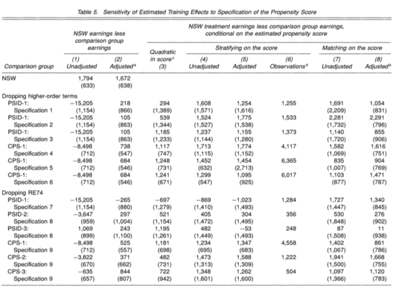

```{r setup, include=FALSE}
knitr::opts_chunk$set(echo = FALSE)
```

## Overview

-   Not always possible to set up a randomized control trial (RCT) -- costly

-   Question: can we reproduce causal effect estimates obtained through a randomized control trial - the gold standard here taken as *ground truth* - using control data from nonexperimental studies? Enter: propensity scores

-   Methodology paper:

    -   Show that applying propensity scores to @lalonde1986evaluating's nonexperimental data can mitigate these concerns
    -   Estimates are not sensitive to the specification of the estimated propensity score, but are sensitive to the assumption of selection on observable

# Data and methodology

## The RCT

NSW -- federally funded support program in the 1970s providing opportunities for work experience to unemployed, economically struggling individuals

-   Treatment randomly assigned ($N_1=297$) among those eligible ($N=722$)

    -   But randomization over a period of two years -- *cohort phenomenom*: change in characteristics of individuals within treatment group

-   @dehejia1999causal further limit themselves to individuals that entered early enough (important to look at several years of preintervention earnings)

## Nonexperimental comparison

-   Panel Study of Income Dynamics
-   Current Population Survey

{width="400"}

## Summary statistics

-   nonexperimental populations differ dramatically from the treatment group in terms of age, marital status, ethnicity, and preintervention earning
-   only small adjustments made in @lalonde1986evaluating (subsets based on one or two pretreatment variables).

{width="400"}

# Lalonde approach

## Lalondes's main findings

-   @lalonde1986evaluating finds large differences between RCT and nonexperimental estimates:

    {width="350"}

-   Concluded that existing econometric techniques could not produce unbiased estimates

## Subsample in @dehejia1999causal

-   Results for subsample that includes on individuals that entered early enough:

    {width="350"}

-   Very much in line with @lalonde1986evaluating, except for the treatment effect being higher for the RCT data (as expected, a higher treatment effect is obtained for those who joined the program earlier)

## Subsample -- including 1974 earnings

-   When including 1974 earnings $\mathbf{x}_{1974}$ as a predictor, findings overall are still similar and essence of @lalonde1986evaluating's claim still holds

-   Mild improvements:

    -   estimates remain largely negative when not controlling for pretreatment covariate, although less so than without controlling for $\mathbf{x}_{1974}$
    -   results in column 5 -- controlling for all pretreatment covariates -- getting us much closer to RCT estimates

# Incorporating propensity scores

## Recap: treatment effect of the treated

-   Goal is to identify the average treatment effect of the treated

```{=tex}
\begin{equation} 
\begin{aligned}
&& \alpha_{ATT}&= \mathbb{E} \left( Y_{i1} | D_i=1 \right) - \mathbb{E} \left( Y_{i0}|D_i=1 \right)\\
\end{aligned}
\end{equation}
```
-   Under the assumption of conditional unconfoundedness -- $(Y_{1i},Y_{0i})\perp\!\!\!\perp D_i|\mathbf{X_i}$ -- we can identify $\alpha_{ATT}$ as

```{=tex}
\begin{equation} 
\begin{aligned}
&& & \mathbb{E}_{\mathbf{X_i}|D_i=1} \left( \mathbb{E} \left( Y_{i1} | D_i=1 \right) - \mathbb{E} \left( Y_{i0}|D_i=1 \right) | D_i=1 \right) \\
\end{aligned}
\end{equation}
```
**Note:** @dehejia1999causal in fact integrate over the entire NSW population ("group of interest"). Not entirely clear why, but anyway treatment and control group in NSW almost the same in terms of pretreatment variables.

## Recap: propensity scores

-   In order to estimate $\alpha_{ATT}$ we need to draw subsets from the nonexperimental control groups that conditional on their covariates $\mathbf{X}_i$ have similar propensities to be treated (as the NWS guys)
-   Denoting the propensity score as $\pi(\mathbf{X}_i)=p(D_i=1|\mathbf{X}_i)$ and assuming that $0 < p(\mathbf{X}_i) < 1 \ \ \forall \ i$ (common support) then

```{=tex}
\begin{equation} 
\begin{aligned}
&& (Y_{1i},Y_{0i})\perp\!\!\!\perp D_i|\mathbf{X_i}&=(Y_{1i},Y_{0i})\perp\!\!\!\perp D_i|\pi(\mathbf{X_i}) \\
\end{aligned}
\end{equation}
```
**Intuition**: observations with the same propensity score have the same distribution of the full vector of covariates.

## Estimation of propensity scores

**Step 1**

-   To estimate propensity scores @dehejia1999causal use logistic regression

```{=tex}
\begin{equation}
\begin{aligned}
&& \pi(\mathbf{X}_i)&=\frac{ \exp( \mathbf{X} \beta )}{1 + \exp(\mathbf{X} \beta)} \\
\end{aligned}
\end{equation}
```
-   They test for interactions and non-linearities but ultimately find that letting all covariates enter linearly does the job

## Estimates

-   Estimated propensity scores for PSID nonexperimental sample -- limited overlap:


-   CPS looks similar, tough less individual with high propensities to be treated

## Estimation

**Step 2**

-   Regression:

    ```{=tex}
    \begin{equation}
    \begin{aligned}
    && Y_{i}&=(\mathbf{1},D_i, \mathbf{X}_i) \beta  \\
    \end{aligned}
    \end{equation}
    ```
    ```{=tex}
    \begin{equation}
    \begin{aligned}
    && Y_{i}&=\left(D_i, \pi(\mathbf{X}_i)\right) \beta  \\
    \end{aligned}
    \end{equation}
    ```

-   Difference in sample means

    -   Sum the within-stratum differences weighted by the number of treated observations within stratum

    -   Propensity score matching (nearest neighbour)

# Results


## Sensitivity analysis

Estimates for treatment impact are:

-   not sensitive to specification of propensity score

-   quite sensitive to selection on observables: When dropping 1974 earnings, results change quite a lot

    -   shows us importance of including pre-intervention variables (lengthy earnings history)
    -   demonstrates value of using multiple comparison groups

## Sensitivity analysis

{width="400"}

## Conclusion

-   Propensity methods can mitigate selection bias and thereby help facilitate the use of nonexperimental data as a comparison population for an RCT

-   This offers a way to test previous RCT results for robustness without the need to set up an expensive follow-up study

## References
